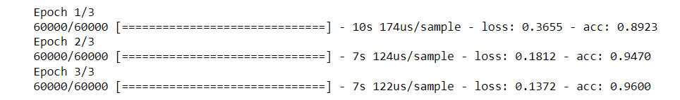

# Basic-Image-Classification-with-TensorFlow
Created and Trained a model that takes an image of a handwritten digit as input and predicts the class of that digit.

## DATASET :
The MNIST database (Modified National Institute of Standards and Technology database) is a large database of handwritten digits that is commonly used for training various image processing systems.

## Model used:
Dense

## Activation Functions used:
RELU and Softmax

## Optimizer used:
Stochastic Gradient

## Loss:
Categorical cross entropy

## Model Accuracy:

96%
